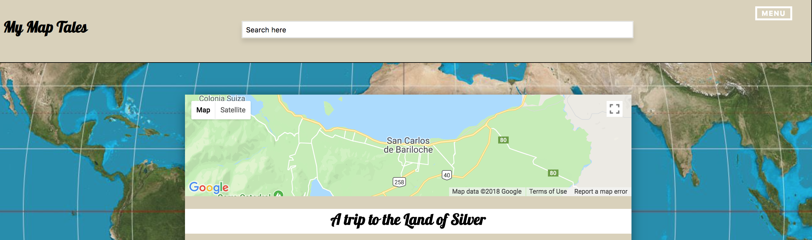

# My-Map-Tales-Front

[Live Site can be found Here](http://www.mymaptales.com/)

I created My Map Tales after the tragic death of Anthony Bourdain. His show, along with my father, encouraged me to travel and get out of my comfort zone at the height of my depression.

Stories of travel always encouraged me that there is still hope in this world, even in the darkest of times.

People can come to this site, share a story from a particular location, and read about peoples tales.

## Search bar, Home, Dashboard

The searchbar in the header allows you to search for existing Stories in our database.

The Home & Dashboard pages will also prepopulate with stories That include the location, date, description and author of the story.

You can click on these tales to read the full post.

## Create Stories

Want to create a story of your own? Click the 'Menu' Button on the top right corner and go to our 'Sign up' page! Already a user? Click 'Login' instead!

## Logged In

Once you're logged in you'll see a few new option under 'Menu' - Dashboard, My Stories, and Create a Story.

Create a Story is where you can share tales of your home, travels... Any place really!

My stories is where you can see stories you've created under the user you're logged in as!

## Demo user

Not interested in signing up? The Login demo below will take you to a user demo
